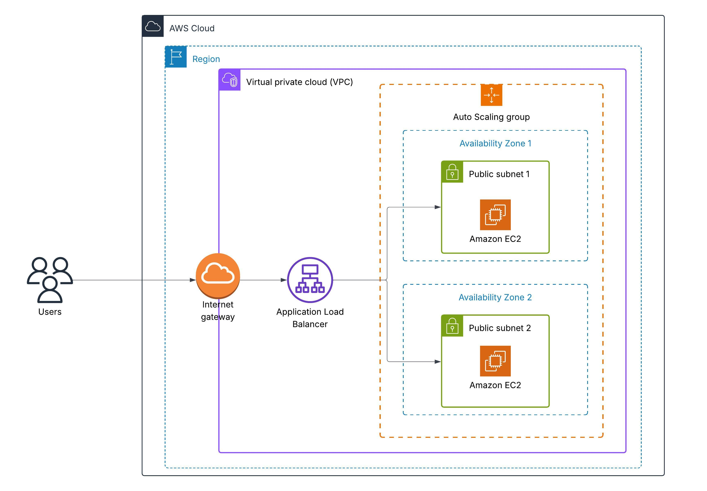

# Ecommerce Order Processing System
This is an asynchronous order processing system built on serverless tools. It is designed to handle incoming orders efficiently, process them in a decoupled manner, and provide notifications upon completion.

## Backend Development

### Architecture Overview


The system uses the following AWS services:

- **API Gateway** - Entry point for incoming orders
- **AWS Order Submission Lambda** - Triggered by API Gateway to validate incoming requests and then pushes requests to the SQS Queue.
- **Amazon SQS** - Queue to decouple the order intake from processing, that triggers another Order Processing Lambda.
- **AWS Order Processing Lambda** -  Receives order messages from SQS and stores order details in DynamoDB. If an error occurs, SQS can retry 5 times and after failures exceed threshold, message is sent to the DLQ.
- **Amazon DynamoDB** - NoSQL database to store order details.
- **Amazon DLQ** - Collects unprocessable messages that failed after multiple Lambda retry attempts.
- **Amazon Cloudwatch Alarms** - Triggers an alarm when a message apperars in DLQ. 
- **Amazon SNS** – Sends an email notification when cloudwatch is in alarm state.

### Sample Order Payload
```
{
    "customer_id": "001",
    "product_id": "Banana",
    "quantity": "1",
    "order_date": "2025-04-25"
}
``` 

## Frontend Development
This project also includes a simple web-based frontend that allows users to place orders through a form. The frontend interacts with the backend API via HTTP requests.

### Architecture Explained



The frontend uses the following AWS services:
- **Application Load Balancer** -  Distributes incoming traffic to healthy EC2 instances.
- **Auto Scaling Group** - Automatically adjusts the number of EC2 instances based on demand or health checks.
- **EC2 Instances** - Serve the static frontend files (HTML, CSS, JavaScript, and images) using an Apache web server


### Files 
The following files/folders are in the frontend folder:

- server.py
- index.html
- style.css
- main.js
- images

All these components are what make up the frontend allowing for order placement that will be sent to API Gateway.


## Terraform-backend
The code in main.tf sets up a serverless API on AWS that allows clients to submit orders via API Gateway, which triggers a Lambda function to send messages to an SQS queue. A second Lambda function is triggered when messages arrive in the queue and processes them by saving order data to a DynamoDB table. A Dead Letter Queue (DLQ) handles failed messages, and a CloudWatch alarm monitors it, sending alerts through an SNS topic with email notifications. IAM roles and permissions are configured throughout to ensure secure interactions between services. 
Files created:
- variables.tf
- providers.tf
- outputs.tf 
As well as the lambda function code in files that will be used by main.tf.

## Terraform-frontend
The code in main.tf provisions an Auto Scaling group of EC2 web servers behind an Application Load Balancer (ALB) that distributes HTTP traffic. It also sets up security groups, a target group, and a launch template that installs the frontend application from GitHub onto each EC2 instance.
Other files created include:
- variables.tf
- providers.tf
- outputs.tf 


## Cloudformation
This CloudFormation template sets up a complete order processing pipeline using API Gateway, Lambda, SQS, DynamoDB, and SNS, enabling a serverless architecture for submitting and storing customer orders. It also includes monitoring and sending notifications by triggering a CloudWatch alarm and SNS email alert when messages accumulate in the dead-letter queue (DLQ).


## Getting started with Terraform Deployment 
To deploy the infastructure using Terraform follow these steps: 

1) For initializing the project:
```
terraform init 
```

2) For reviewing the execution plan:
```
terraform plan
```

3) Apply the configuration to provision resources:
```
terraform apply
```

4) To tear down the infrastructure: 
```
terraform destroy
```